# Florida Keys Dive Planner WebGIS

A bilingual, mobile-first WebGIS portfolio project for exploring Florida Keys dive sites, planning boat trips, matching recreational certifications to depth, and connecting divers with nearby dive centers.

**Live demo:** https://dive-planner-webgis-v3.florida-keys-dive-planner.workers.dev

## What I implemented

- Designed and built the interactive planning experience with React, TypeScript, Leaflet and Turf.js.
- Implemented map-driven filtering, certification/depth matching, distance analysis and boat-trip planning workflows.
- Built and integrated GeoServer/WFS + GeoPackage in V1, followed by FastAPI + PostgreSQL/PostGIS + Alembic + Docker in V2.
- Implemented authentication, role-based access control, comments, ratings, favorites, Dive Center submissions and Admin moderation.
- Migrated the public V3 deployment to Cloudflare Workers + D1 + bundled official GeoJSON to remove free-tier cold starts.
- Managed the architecture evolution through Git branches, pull requests and tagged releases.

## Technology stack

React, TypeScript, Vite, Leaflet, Turf.js, Cloudflare Workers, Static Assets, D1 and Wrangler. Earlier tagged releases also demonstrate GeoServer/WFS, GeoPackage, FastAPI, PostgreSQL/PostGIS, Docker and Alembic.

## Key features

- Four goal-driven planning flows with English/Turkish UI.
- Certification-aware depth matching and combined dive-type/distance filtering.
- Departure selection, nautical-mile distance, boat time, reach zones and route lines.
- Rich dive-site and dive-center details with transparent attribution and fallbacks.
- Accounts, comments, ratings, favorites, Dive Center submissions and ADMIN moderation.
- Clear separation between 63 official dive sites and approved community contributions.

## Screenshots

### WebGIS planning experience

The map keeps planning controls, spatial results and the synchronized dive-site catalog visible in one workspace.

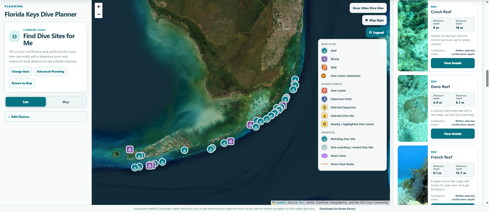

<details>
<summary>View more planning screens</summary>

| Goal-driven start | Boat reach-zone planning |
|---|---|
| 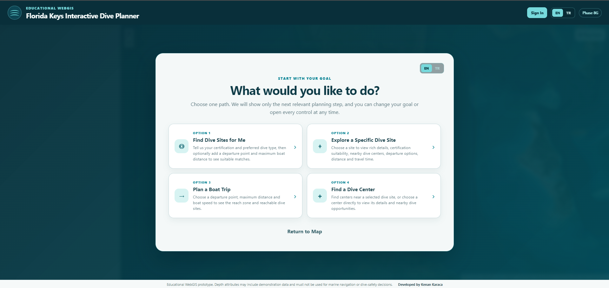 | 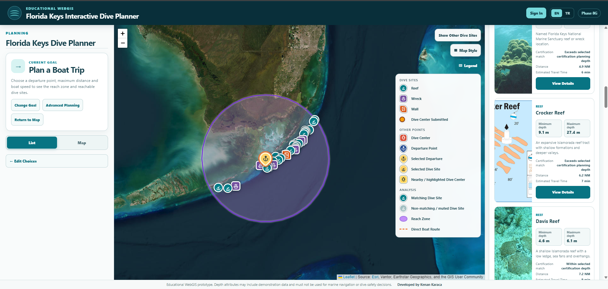 |

| Dive-center details | Nautical map context |
|---|---|
| 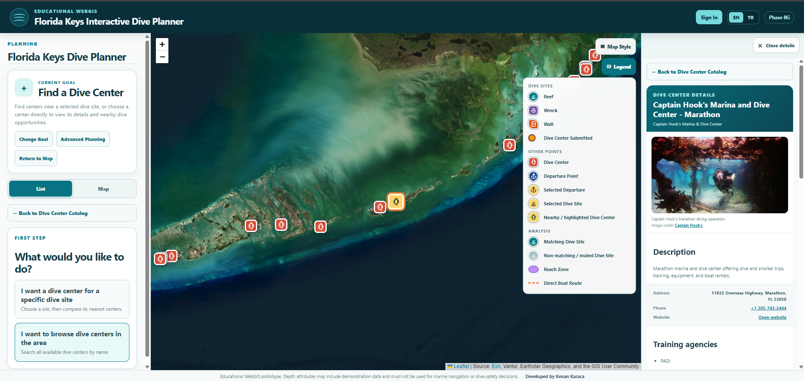 | 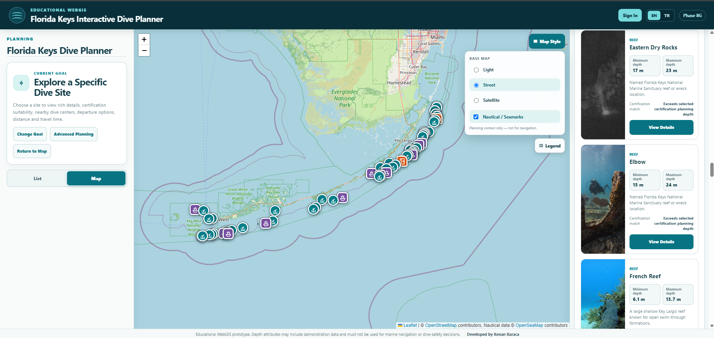 |

</details>

### Community features

Authenticated users can save dive sites, rate them and participate in site-specific discussions.

| Favorites | Ratings and comments |
|---|---|
| 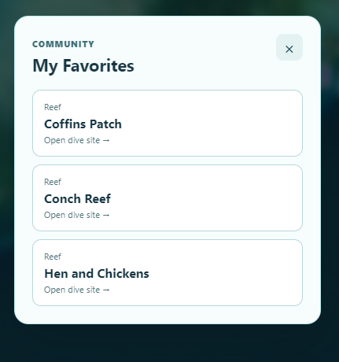 | 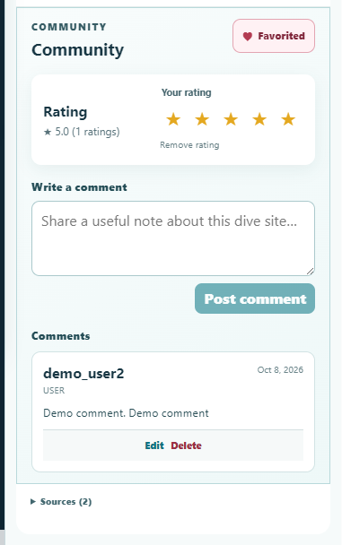 |

### Dive Center portal

Dive Center accounts manage a public-facing profile and map location, then submit spatial dive-site contributions for review.

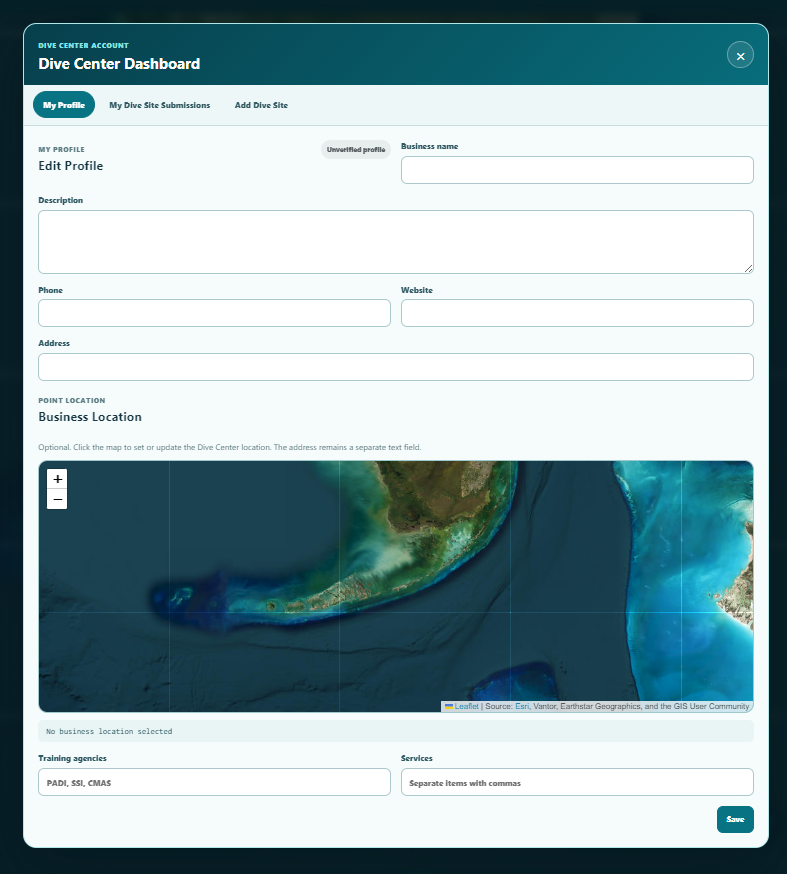

<details>
<summary>View the submission workflow</summary>

| Map-based dive-site submission | Pending owner view |
|---|---|
| 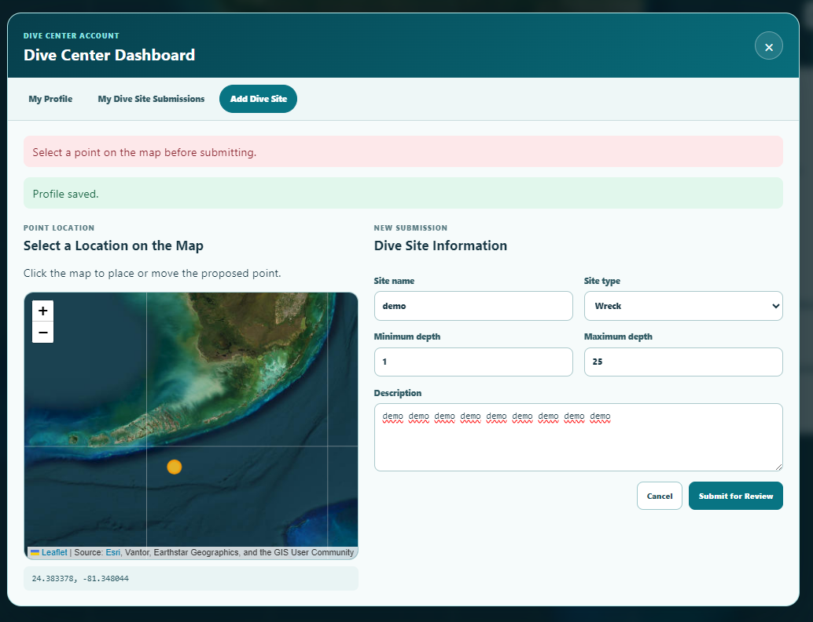 | 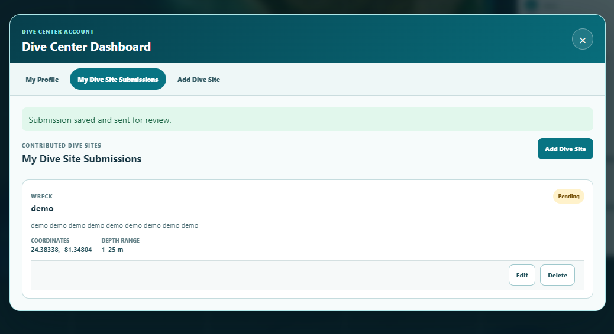 |

**Workflow:** Dive Center selects a map location → creates a submission → `PENDING` → Admin reviews the spatial record → approves or rejects it → approved contributions become public → Admin can later archive/unpublish them.

</details>

### Administration and moderation

The Admin Panel provides a compact operational overview and separate review surfaces for profiles, comments and contributed dive sites.

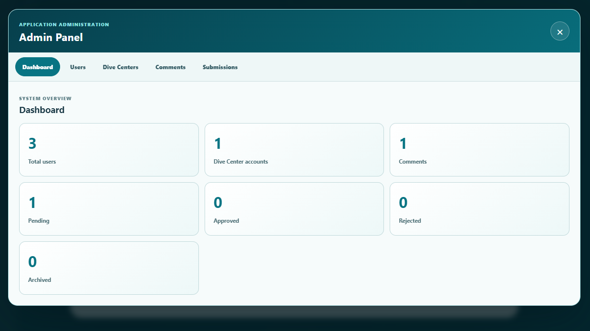

<details>
<summary>View the admin workflow</summary>

| Dive Center verification | Comment moderation |
|---|---|
| 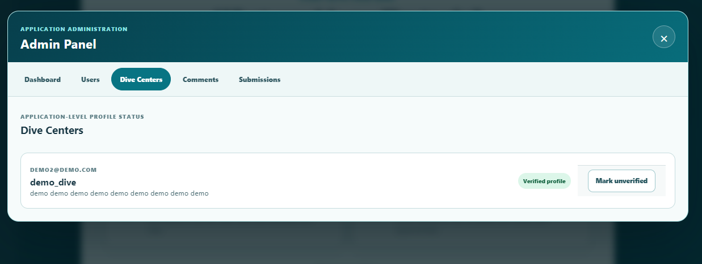 | 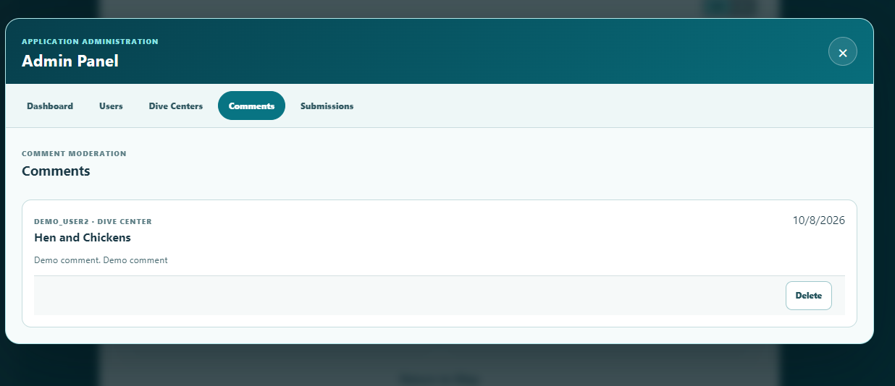 |

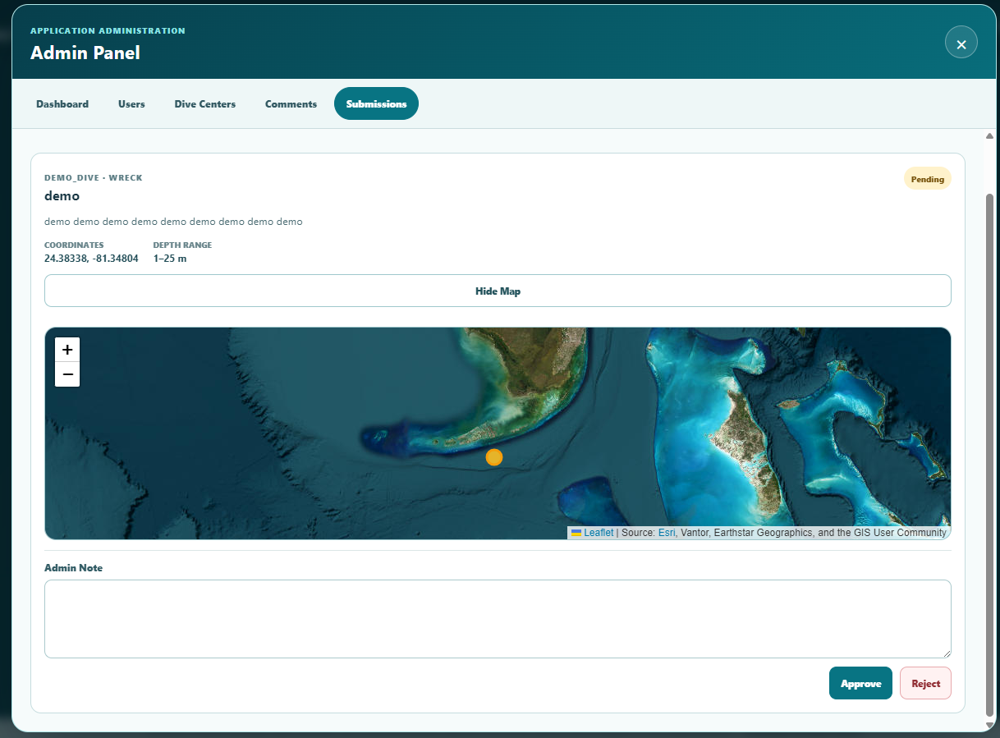

</details>

## V3 architecture

V3 is a fully serverless Cloudflare deployment:

```text
Cloudflare Worker + Static Assets
├── React/Vite application
├── Official bundled GeoJSON (read-only)
│   ├── 63 dive sites
│   ├── 19 dive centers
│   └── 85 departure points
└── /api/* Worker API
    └── Cloudflare D1
        ├── users and HttpOnly sessions
        ├── comments, ratings and favorites
        ├── dive-center profiles
        └── contributed dive-site review workflow
```

Production V3 does not call Render, GeoServer, PostGIS, localhost, or another application origin. The source GeoPackage remains authoritative for the three official point layers. `scripts/export_v3_geojson.py` produces deterministic static copies and refuses unexpected record counts.

## Architecture evolution

| Version | Architecture | Why it exists |
|---|---|---|
| V1 | Netlify frontend → Render GeoServer/WFS → GeoPackage | Established the WebGIS, map layers, certification rules, filtering and bilingual planning UX. |
| V2 | Cloudflare frontend/proxy → Render FastAPI → Render PostgreSQL/PostGIS, plus Render GeoServer | Added accounts, RBAC, community data, dive-center portal and admin review while demonstrating a conventional geospatial backend. Frozen at Git tag `v2.0.0`. |
| V3 | Cloudflare Worker + Static Assets → bundled official GeoJSON + D1 | Removes cold starts and multi-service production coupling while retaining the official dataset and full portfolio workflows in one serverless deployment. |

V1 and V2 remain in Git history for architecture comparison. V3 intentionally keeps official data separate from Dive Center Submitted data.

## Why the architecture changed

GeoServer/WFS and FastAPI/PostgreSQL/PostGIS were intentionally built and used in V1/V2; they remain evidence of WebGIS, spatial-database and API experience. V3 does not replace those technologies because they were conceptually wrong or unnecessary. The public portfolio deployment moved to Cloudflare's serverless stack to remove free-tier service sleep, cold-start and database-expiry risks for visitors opening a shared LinkedIn or GitHub link. The earlier implementations remain preserved in tags and branches.

## Security model

- Passwords use Worker-compatible PBKDF2-SHA-256 with a random per-user salt and 100,000 iterations.
- Authentication uses random, server-stored sessions in `HttpOnly; Secure; SameSite=Strict` cookies; tokens are never stored in browser storage.
- Every privileged endpoint enforces server-side RBAC.
- State-changing requests require the same browser origin.
- D1 access uses bound parameters, strict request fields, length/range validation and bounded request bodies.
- Registration, login, bootstrap and submissions have D1-backed rate limits.
- Error responses do not expose stack traces, database details or credentials.
- Worker responses include CSP, anti-framing, MIME-sniffing, referrer and permissions headers.

## Local development

```powershell
npm install
python scripts/export_v3_geojson.py
npm run build
npx wrangler d1 migrations apply DB --local
npx wrangler dev --local
```

For local ADMIN bootstrap only, copy `.dev.vars.example` to `.dev.vars`, replace the placeholder locally, and call `POST /api/admin/bootstrap`. Never commit `.dev.vars` or credentials.

Focused validation:

```powershell
npm run test:v3-data
npm run cloudflare:check
```

The API end-to-end script reads its test origin and test credentials only from environment variables:

```powershell
npm run test:v3-api
```

## Cloudflare deployment

1. Create the D1 database: `npx wrangler d1 create dive-planner-v3`.
2. Replace the placeholder `database_id` in `wrangler.jsonc` with the returned ID.
3. Apply schema: `npx wrangler d1 migrations apply DB --remote`.
4. Build and deploy: `npm run build` then `npx wrangler deploy`.
5. Add a temporary `ADMIN_BOOTSTRAP_SECRET` Worker secret, create the first ADMIN through the one-time endpoint, then delete that secret immediately.

No database URL, JWT secret, API origin, GeoServer origin, or production password is required by V3. Cloudflare bindings and encrypted Worker secrets are used instead.

## Data and attribution

Official GIS features are read-only portfolio data derived from the repository GeoPackage. Community submissions are independently stored and clearly labeled **Dive Center Submitted**; approval never inserts them into the official 63-site dataset. Basemap and nautical-overlay attribution remains visible in the map UI. This is a demonstration and planning aid, not a marine-navigation or diving-safety system. It is not a substitute for current operator guidance, certification standards, weather checks or professional dive planning.

## Repository milestones

- `v1.0.0`: GeoServer/WFS + GeoPackage milestone
- `v2.0.0`: FastAPI/PostGIS full-stack milestone
- `v3.0.2`: current serverless portfolio release
